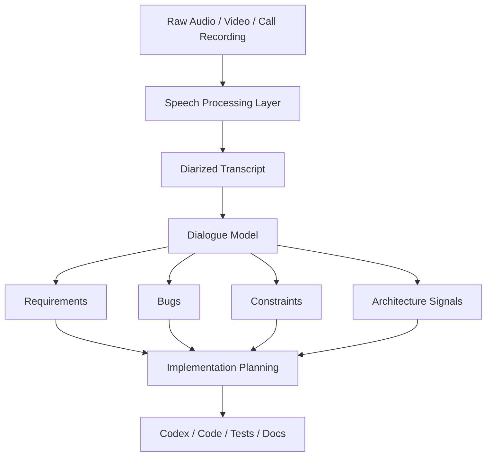

# signalnoise

> Extracting structured system knowledge from raw conversations.

## Premise

Important engineering knowledge is rarely born as documentation.

It emerges in:
- conversations
- debugging sessions
- requirement clarifications
- fragmented reasoning
- behavioral exploration of systems

Most of this knowledge is noisy, implicit, and quickly lost.

**signalnoise** is a system for turning that noisy surface into structured engineering artifacts.

```text
speech › dialogue › structure › system understanding › execution
```

---

## What This Project Is

This project is NOT:

* a generic speech-to-text wrapper
* a Whisper demo
* a meeting summarizer
* a note-taking assistant

This project IS:

* a knowledge extraction system
* a conversation-to-architecture transformation layer
* an engineering intelligence workflow
* a bridge between human reasoning and formal artifacts

---

## Core Idea

Conversations are compressed systems.

They contain:

* requirements
* bugs
* constraints
* architecture signals
* implementation intent
* uncertainty
* negotiation of system boundaries

signalnoise is designed to decompress those signals into reusable engineering structure.

---

## System Overview



---

## Layers

### 1. Speech Processing Layer

Transforms raw recordings into structured transcripts with:

* transcription
* alignment
* speaker diarization
* exportable machine-readable artifacts

See:

* `pipelines/speech/README.md`

### 2. Postprocessing Layer

Transforms transcripts into:

* `requirements.md`
* `bugs.md`
* `constraints.md`
* `architecture.md`
* `codex_prompt.md`

See:

* `pipelines/speech/POSTPROCESSING.md`

### 3. Execution Layer

Transforms extracted structure into:

* implementation tasks
* tests
* prompts for Codex
* engineering plans

---

## Repository Structure

```bash
signalnoise/
├── README.md
├── pipelines/
│   └── speech/
│       ├── README.md
│       ├── POSTPROCESSING.md
│       ├── run.sh
│       └── postprocess.sh
├── docs/
│   ├── architecture.md
│   ├── runtime-layout.md
│   └── diagrams/
├── public-process/
│   ├── draft/
│   └── examples/
└── scripts/
```

---

## Local Runtime Layout

This repository assumes a broader local AI workspace.

```bash
~/AI/
├── cache/
│   ├── huggingface/
│   ├── torch/
│   ├── uv/
├── datasets/
│   ├── raw_audio/
│   ├── processed_audio/
├── outputs/
│   └── whisperx/
└── systems/
    └── signalnoise/
        ├── repo/
        ├── runs/
        ├── configs/
        └── logs/
```

This separation is intentional:

* `~/AI/cache` stores shared model/runtime artifacts
* `~/AI/datasets` stores shared inputs
* `~/AI/outputs` stores generated artifacts
* `~/AI/systems/signalnoise` stores the system-specific workspace

This keeps the project modular, reproducible, and aligned with platform-style engineering.

---

## Dialogue Abstraction Model

All published examples are anonymized and role-normalized.

```text
SystemThinker › defines intent, constraints, system logic
CodeRunner    › probes implementation, validates behavior, exposes inconsistencies
```

These are not identities.
They are roles in system reasoning.

This abstraction enables:

* anonymization
* reuse across cases
* pattern-based analysis
* publication without leaking sensitive context

---

## Why This Matters

Modern engineering loses context constantly.

Knowledge disappears between:

* calls
* chats
* debugging sessions
* API testing
* undocumented decisions

signalnoise addresses that loss by treating conversation as a first-class engineering input.

The goal is not better transcription.

The goal is:

* better system understanding
* better artifact generation
* better continuity between thought and implementation

---

## Current Focus

The first working subsystem is:

**Speech Processing Pipeline (WhisperX + Diarization)**

This layer is already sufficient to:

* normalize call recordings
* transcribe multilingual audio
* separate speakers
* export structured transcript artifacts

It serves as the operational foundation for the rest of the system.

---

## Long-Term Direction

signalnoise is intended to evolve toward:

* automatic semantic classification
* transcript-to-artifact pipelines
* conversation-driven bug extraction
* architecture reconstruction from dialogue
* requirement synthesis from noisy calls
* Codex-ready execution planning
* integration with engineering workflows

---

## Status

Early-stage research and engineering system.

The speech layer is working.
The postprocessing layer is being formalized.
The long-term goal is a reproducible conversation-to-system pipeline.

---

## Positioning

```text
signalnoise is not about speech.

It is about extracting systems from human reasoning.
```


